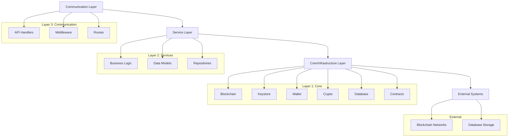
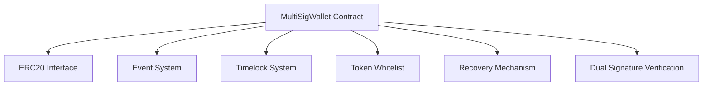
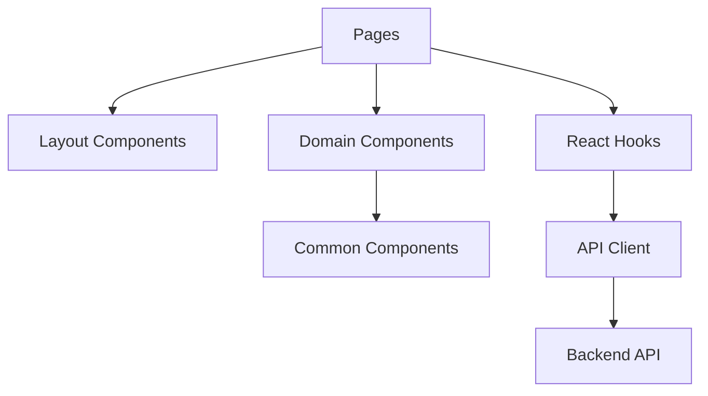
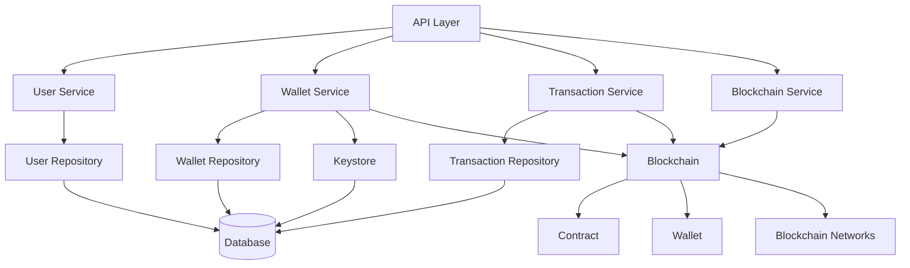
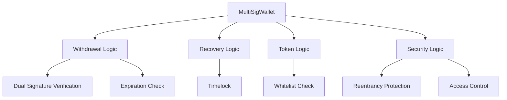
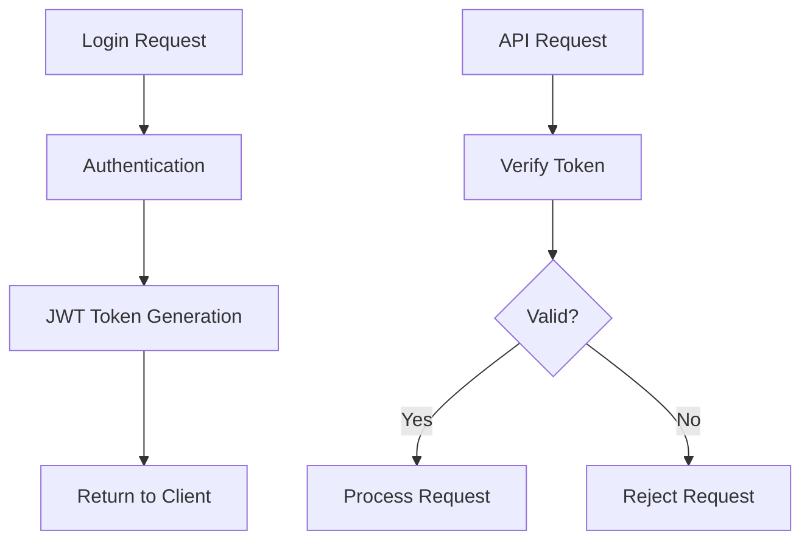

# Vault0 System Patterns

## System Architecture

The Vault0 project follows a comprehensive multi-layer architecture across its three main components: smart contracts, backend services, and frontend application.

### Three-Layer Backend Architecture

The Go backend implements a clear separation of concerns through a three-layer architecture:



1. **Layer 1: Core/Infrastructure**
   - Located in `internal/core/`
   - Provides fundamental building blocks
   - Interfaces with external systems
   - Handles low-level operations

2. **Layer 2: Service Layer**
   - Located in `internal/services/`
   - Implements business logic
   - Domain-specific operations
   - Data models and repositories

3. **Layer 3: Communication Layer**
   - Located in `internal/api/`
   - Exposes functionality through REST endpoints
   - Manages request/response handling
   - Implements middleware for cross-cutting concerns

### Smart Contract Architecture

The smart contract component centers around the MultiSigWallet contract:



### Frontend Architecture

The Next.js frontend follows a component-based architecture:



## Key Technical Decisions

### 1. Go for Backend Development

**Decision**: Implement the backend in Go rather than Node.js or other alternatives.

**Rationale**:
- Performance benefits for cryptographic operations
- Strong type system reduces runtime errors
- Excellent concurrency model
- Compiles to a single binary for easy deployment
- Good support for blockchain integration

### 2. Multi-Layer Architecture

**Decision**: Structure the backend in three distinct layers.

**Rationale**:
- Clear separation of concerns
- Improved testability
- Better maintainability
- Flexibility to change implementations

### 3. Interface-Driven Development

**Decision**: Define interfaces before implementations across the system.

**Rationale**:
- Enables dependency injection
- Facilitates testing through mocks
- Allows multiple implementations
- Decouples components

### 4. SQLite Database

**Decision**: Use SQLite for data persistence.

**Rationale**:
- Simplifies deployment (no separate database server)
- Sufficient performance for expected load
- Reliable and well-tested
- File-based storage fits the application needs

### 5. Dual-Signature Security Model

**Decision**: Require two signatures (client and manager) for withdrawals.

**Rationale**:
- Eliminates single point of failure
- Implements separation of duties
- Provides appropriate security for high-value operations
- Balances security with usability

### 6. 72-hour Timelock Recovery

**Decision**: Implement a 72-hour timelock for recovery operations.

**Rationale**:
- Provides sufficient time to detect unauthorized recovery attempts
- Balances security with practical recovery needs
- Long enough for intervention but not excessively delayed

## Design Patterns

### Repository Pattern

Used throughout the service layer to abstract data access:

```go
// Repository interface example
type UserRepository interface {
    Create(ctx context.Context, user *User) error
    FindByID(ctx context.Context, id uuid.UUID) (*User, error)
    Update(ctx context.Context, user *User) error
    Delete(ctx context.Context, id uuid.UUID) error
}
```

### Factory Pattern

Used for creating blockchain, contract, and wallet instances:

```go
// Factory example
func NewBlockchain(ctx context.Context, config *BlockchainConfig) (Blockchain, error) {
    switch config.Type {
    case "evm":
        return NewEvmBlockchain(ctx, config)
    default:
        return nil, fmt.Errorf("unsupported blockchain type: %s", config.Type)
    }
}
```

### Dependency Injection

Used throughout the application to provide dependencies:

```go
// Service constructor with injected dependencies
func NewUserService(
    repo UserRepository, 
    keystore Keystore,
    logger *logger.Logger,
) *UserService {
    return &UserService{
        repo:     repo,
        keystore: keystore,
        logger:   logger,
    }
}
```

### Middleware Pattern

Used in the API layer for cross-cutting concerns:

```go
// Middleware example
func AuthMiddleware(authService *AuthService) gin.HandlerFunc {
    return func(c *gin.Context) {
        token := extractToken(c)
        if token == "" {
            c.AbortWithStatusJSON(http.StatusUnauthorized, ErrorResponse{
                Error: "missing authentication token",
            })
            return
        }
        
        userID, err := authService.ValidateToken(token)
        if err != nil {
            c.AbortWithStatusJSON(http.StatusUnauthorized, ErrorResponse{
                Error: "invalid authentication token",
            })
            return
        }
        
        c.Set("userID", userID)
        c.Next()
    }
}
```

### Service Pattern

Used to encapsulate business logic:

```go
// Service example
type WalletService struct {
    repo       WalletRepository
    blockchain Blockchain
    keystore   Keystore
    logger     *zap.Logger
}

func (s *WalletService) CreateWallet(ctx context.Context, userID uuid.UUID, chainID uint64) (*Wallet, error) {
    // Business logic implementation
}
```

## Component Relationships

### Backend Components



### Smart Contract Components



### User Authentication Flow



### Transaction Flow

```mermaid
flowchart TD
    Client[Client] --> Init[Initiate Withdrawal]
    Init --> Store[Store in Database]
    Store --> Notify[Notify Manager]
    
    Manager[Manager] --> Review[Review Withdrawal]
    Review --> Approve{Approve?}
    
    Approve -->|Yes| Sign[Sign Transaction]
    Approve -->|No| Reject[Reject Transaction]
    
    Sign --> Submit[Submit to Blockchain]
    Submit --> Verify[Verify Dual Signatures]
    Verify --> Execute[Execute Transfer]
